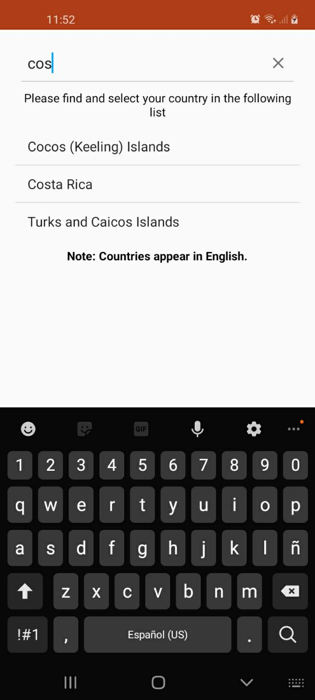
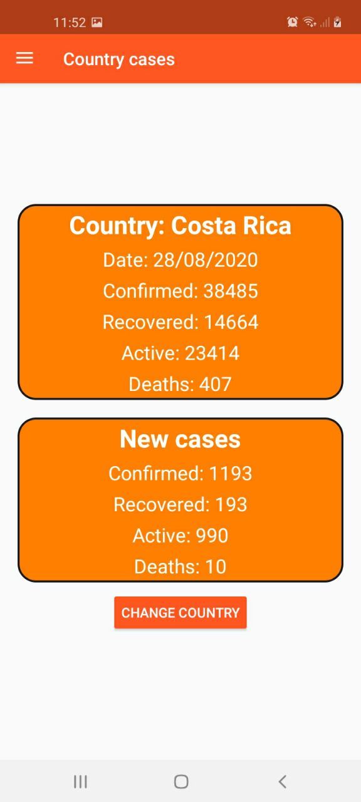
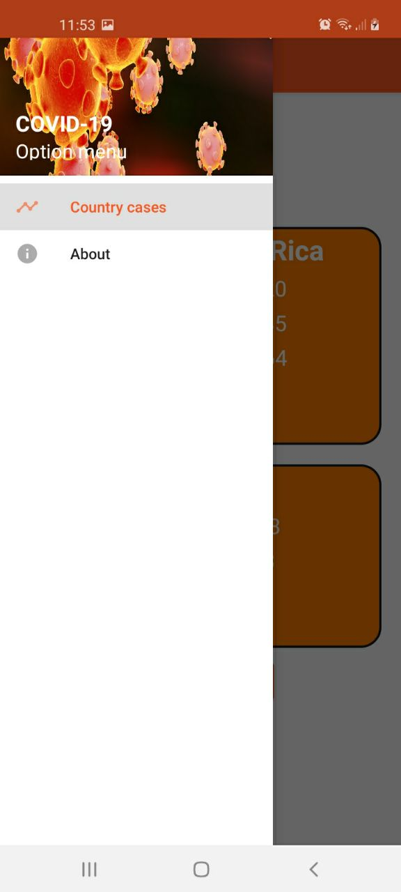

# Info COVID 19 App

Aplicación que muestra los casos de coronavirus del país deseado (si dicho país ha reportado casos). 

[API del utilizada aquí](https://api.covid19api.com/)

### Nota

Esta aplicación fue realizada meramente con fines prácticos.

## Sección de Selección

Se ingresa el país y se selecciona en la lista.

## Sección de los casos

En este apartado se muestra el total de casos del día anterior del país deseado y los nuevos casos, el cual se calcula con la resta de los casos de ayer y antier.

## Acerca de

Información personal del autor de la aplicación.

### Autor 
Sebastián Rojas Vargas.
* [LinkedIn](https://www.linkedin.com/in/sebastian-rojas-vargas/)
* [GitHub](https://github.com/SebastianRV26)
